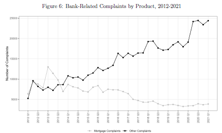
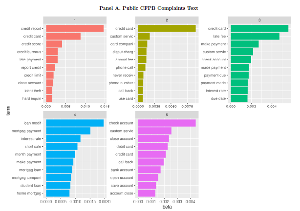

**Presented:** Federal Reserve Board, AEA Annual Meeting, JAAF-ATP India
Symposium, Yale University, Haskayne and Fox Accounting Conference, the IMF, and AAA Annual Meeting, FDIC*

_ABSTRACT: We study whether the disclosure of consumer complaints about their banks changes affected banks’ provision of consumer credit. Using a novel confidential dataset containing consumer complaints from the Consumer Financial Protection Bureau (CFPB) and matching it with confidential data on mortgages, deposits, and market prices, we find that banks subject to prudential and CFPB oversight, which receive consumer complaints experience a decline in their share prices and an increase in trading volumes. These banks also see a decrease in deposit and mortgage market shares, with more complaints resulting in higher deposit withdrawals. We find limited evidence that banks change deposit rates in response. Finally, we implement textual analysis to study the differential impact of consumer complaints. First, we identify the main topics related to the complaints. Second, we find that consumer disappointment is associated with a decrease in aggregate deposits. Overall, we provide new evidence on the role of information disclosure as a disciplinary mechanism in providing credit.
(previously circulated as “Regulatory Disclosure and Access to Credit”)_

**<u>Summary:</u>**

When consumer complaints about banks are publicly disclosed by the Consumer Financial Protection Bureau (CFPB), these disclosures can impact the banks' financial behavior. This paper investigates the impact of publicly disclosing consumer complaints on banks' financial behavior, using data from the Consumer Financial Protection Bureau (CFPB). By examining variations in stock prices, deposit levels, and market shares in the residential mortgage market, the study assesses how these disclosures serve as a disciplinary mechanism within the financial sector.

**Impact on Bank Behavior:**

- Banks subject to CFPB oversight that receive consumer complaints face several financial consequences when these complaints are publicly disclosed:

- Stock Prices: Public disclosure of complaints leads to a decline in stock prices and increased market uncertainty. This is illustrated by wider bid-ask spreads and higher trading volumes, reflecting investor concerns over the financial stability of these banks.

- Depositor Behavior: The disclosure of complaints prompts significant deposit withdrawals, particularly in banks with higher volumes of complaints. This reaction is more pronounced in regions where complaints are filed, suggesting that depositors view complaint disclosures as a signal of risk.

- Mortgage Market Impact: Banks with disclosed complaints experience a reduction in their residential mortgage market shares. This spillover effect highlights how negative public perceptions can influence broader financial services, beyond just deposit behaviors.

**Testing the Impact:**

To validate the impact of consumer complaint disclosures, the study examines the following:

- Timeline Analysis: Figure 1 presents a timeline of key changes in the CFPB complaints database, including the introduction of complaint types and the start of consumer narrative disclosures. This timeline provides crucial context for understanding the evolution of the database and its impact on bank behavior.

- Complaint Distribution: Figure 6 shows the distribution of complaints over time, distinguishing between mortgage-related and non-mortgage-related complaints. The figure highlights the increasing number of complaints over the years, which aligns with growing public awareness and expanded complaint categories.

- Topic Analysis: Figure 10 employs Latent Dirichlet Allocation (LDA) to analyze the main topics within consumer complaints. The analysis identifies five key topics, with a focus on the most frequently discussed issues in both the public and confidential complaints databases. This figure emphasizes the range of issues driving consumer dissatisfaction and their potential impact on banks.

**Results:**

- Stock Market Reactions: A 10pp increase in complaint disclosure correlates with a 1.7pp decrease in stock prices, reflecting market sensitivity to negative disclosures.

- Deposit Withdrawals: Banks with a high volume of complaints experience significant deposit withdrawals, especially in counties with intense complaint activity.

- Mortgage Market Spillover: The analysis shows a decline in mortgage market share for banks with disclosed complaints, indicating that the impact of public disclosures extends beyond deposits to other financial services.

**Takeaways:**

This research highlights the importance of transparency in the financial sector. Public disclosure of consumer complaints acts as an effective tool for disciplining banks, influencing their financial behavior and stability. The study's findings have significant policy implications, particularly regarding the potential spillover effects of commercial market dynamics on broader financial outcomes, including those in government-sponsored programs like mortgage markets.

**Policy Implications:**

    - Market Discipline: The study demonstrates that public disclosure of consumer complaints can serve as a critical mechanism for disciplining banks, encouraging greater transparency and accountability in the financial sector.

    - Spillover Effects: The impact on mortgage markets suggests that negative perceptions of banks can influence consumer behavior across various financial products, with broader implications for market stability.

    - Bank Strategies: Banks may need to adopt proactive strategies to manage their reputations and respond to consumer complaints effectively, mitigating potential negative financial impacts from public disclosures.